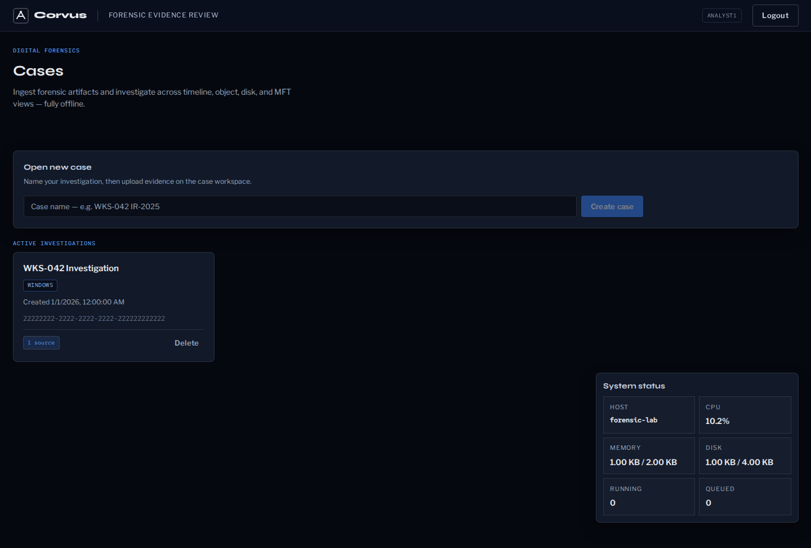
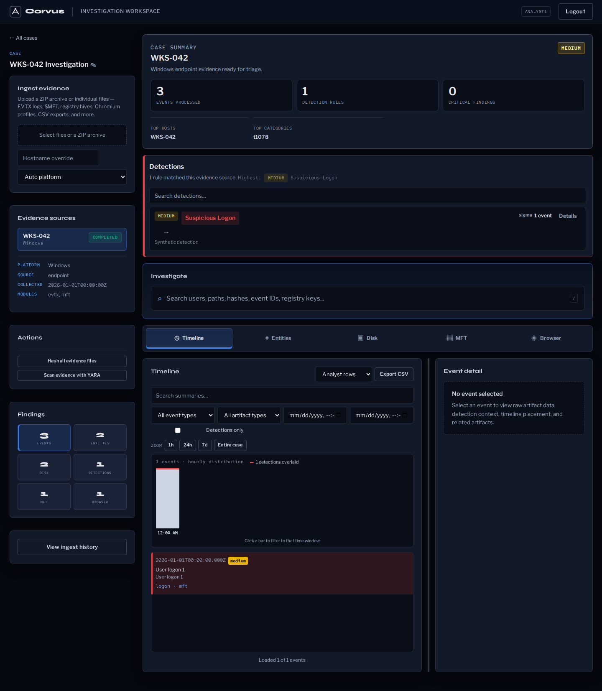
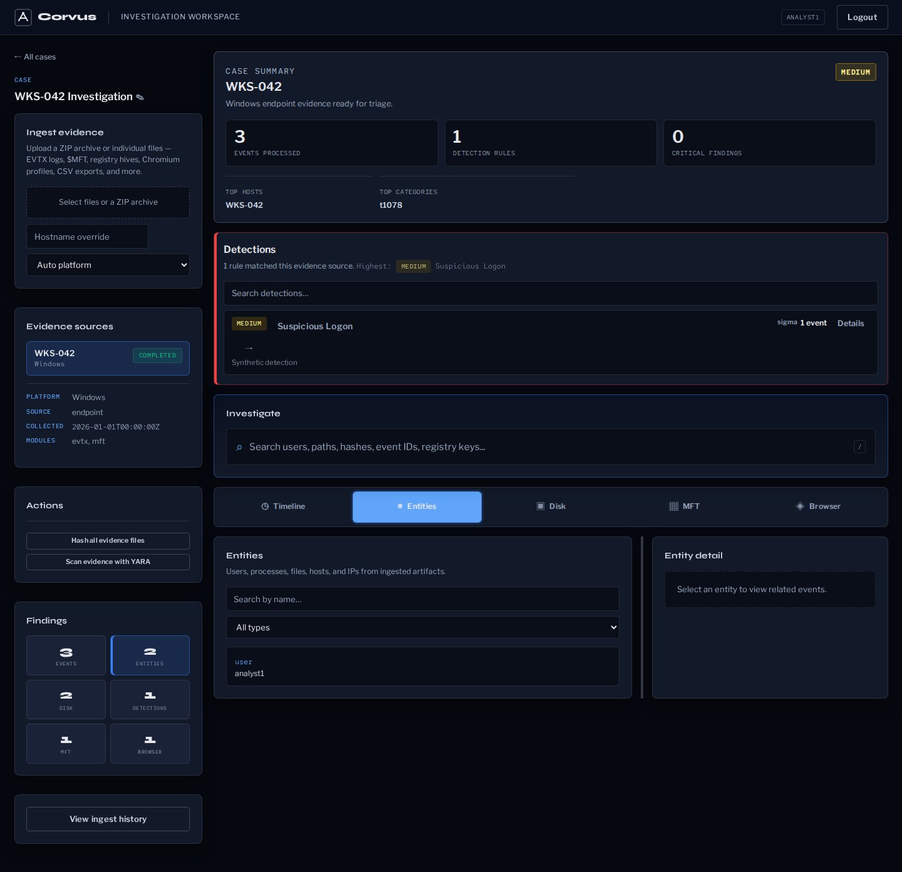
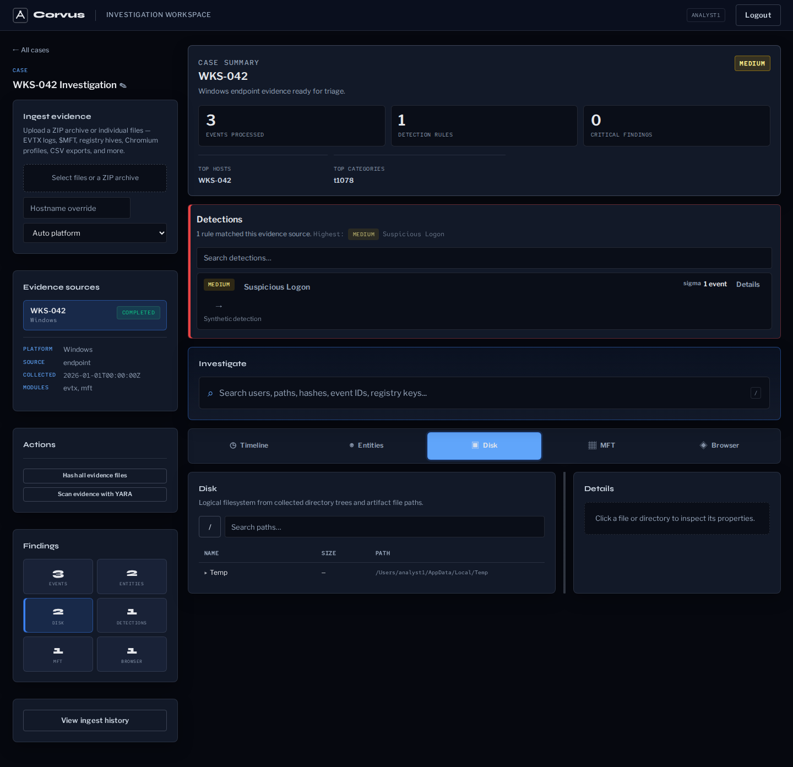
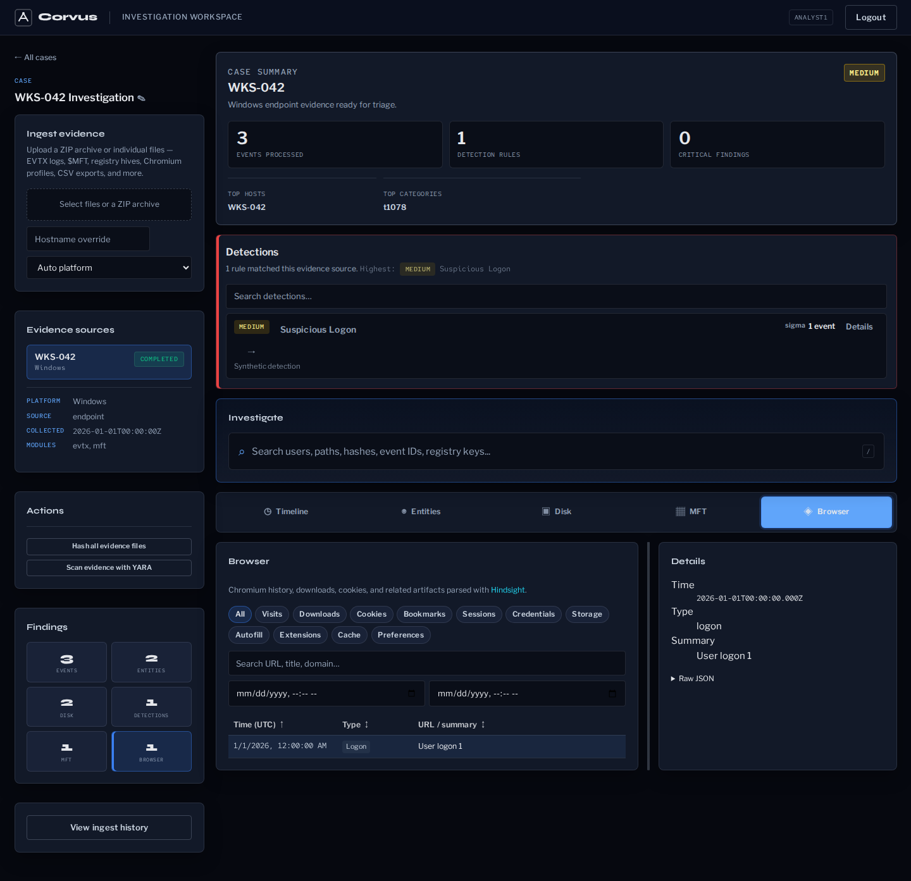

# Corvus

Offline forensic triage review platform for endpoint investigations. Ingest Windows, macOS, and Linux evidence packages, normalize parsed and raw artifacts through source adapters and forensic parsers, hunt threats with detection engines, and investigate through linked **Timeline**, **Object**, **Disk**, and **Browser** views.



> **Intended use.** Corvus is a defensive DFIR triage tool for authorized
> forensic and incident-response work on evidence you are permitted to process.
> The default Docker stack ships development defaults and is meant for a trusted,
> localhost-only host — read [SECURITY.md](SECURITY.md) before any shared or
> exposed deployment. You are responsible for the legality of the evidence you
> handle and for complying with the licenses of the third-party tools and rules
> Corvus downloads (see [THIRD_PARTY_NOTICES.md](THIRD_PARTY_NOTICES.md)).

## Architecture

```
apps/api/          FastAPI + PostgreSQL — REST API and ingest orchestration
apps/worker/       Celery — source adapters, forensic parsers, Sigma/Chainsaw detection, Hindsight
apps/web/          React + Vite — case management and investigation UI
packages/corvus_core/  Shared Pydantic schemas and constants
```

Services: `api`, `worker`, `beat` (Sigma rule sync scheduler), `web`, `postgres`, `redis`, `opensearch`, and optional `playwright` for containerized web e2e runs.

## Quick Start

```bash
cp .env.example .env
./scripts/rebuild-stack.sh
```

| Service | URL |
|---------|-----|
| Web UI | http://localhost:5173 |
| API | http://localhost:8000 |
| API docs | http://localhost:8000/docs |
| Readiness | http://localhost:8000/health/ready |
| OpenSearch | http://localhost:9200 |

## Authentication (Local Dev)

Corvus now enforces API and UI authentication by default using local username/password plus JWT bearer tokens.

- Public routes: `/health`, `/health/ready`, `/api/v1`, `/api/v1/auth/login`, docs endpoints.
- Authenticated routes: `POST /api/v1/auth/logout`, `GET /api/v1/auth/me`, and the analyst workflow routes under `/api/v1/*`.
- Administrator-only routes: user-management auth routes, `/api/v1/admin/*`, `/api/v1/validation/*`, and `/api/v1/containers/*`.
- Roles:
  - `administrator`: full workflow + user management
  - `analyst`: normal forensic workflow (no user management)

### Bootstrap initial admin

Set these variables before startup:

```bash
AUTH_BOOTSTRAP_ADMIN_USERNAME=admin
AUTH_BOOTSTRAP_ADMIN_PASSWORD='<choose-a-strong-password>'
AUTH_SECRET_KEY='<random-secret-string>'
```

On API startup, if that username does not already exist, it is created as an active `administrator`.
`.env.example` ships with `AUTH_BOOTSTRAP_ADMIN_PASSWORD` **blank**, so no admin is auto-created until you set it to a strong value. No credentials are hardcoded.

### Current provider and future OIDC plumbing

- Current provider: `LocalAuthProvider` (`apps/api/app/auth/providers.py`) with bcrypt password hashing.
- Token and auth dependencies: `apps/api/app/auth/service.py`.
- Future provider hook: placeholder `OidcAuthProvider` in the same provider module. Entra/OIDC can be added by implementing the same auth provider contract and keeping role checks/dependencies unchanged.

## Prerequisites

- Docker Engine 24+ and Docker Compose v2
- 16 GB RAM minimum (32 GB recommended)
- 500 GB SSD minimum for evidence storage

For Linux vs Windows Server selection, run the parser smoke tests first — see [Deployment](#deployment).

## Evidence Packages

Corvus ingests folders or ZIPs containing endpoint evidence. Packages can include pre-parsed tool output, raw artifacts, filesystem paths, and optional metadata for Windows, macOS, or Linux sources. KAPE collections are supported, but they are one compatible package shape rather than the only intended source.

**Recommended package layout:**

```text
WKS-042_20250528/
  manifest.json          ← optional but recommended
  C/                     ← raw target files
  EvidenceOfExecution/   ← parser/module output (pre-parsed CSVs)
  Registry/
  EventLogs/
  ...
```

**Ingest priority:**

1. Parser CSV/JSON — EvtxECmd, MFTECmd, PECmd, RECmd, AmcacheParser, log exports, and source-adapter output
2. Raw artifacts — `.evtx`, registry hives, prefetch, `$MFT`, browser profiles, logs, and other supported artifacts
3. Collected files — filesystem nodes from paths and timestamps

See [docs/EVIDENCE-PACKAGE.md](docs/EVIDENCE-PACKAGE.md) for the full format reference.

## Investigation Views

| View | Content |
|------|---------|
| **Timeline** | Chronological events across all artifact sources with date-range and event-type filters |
| **Object** | Extracted entities — users, processes, files, hosts, IP addresses — with cross-view links |
| **Disk** | Logical filesystem tree from collected paths and file metadata |
| **Browser** | Chromium history, downloads, and cookies via [Hindsight](https://github.com/obsidianforensics/hindsight) |

<table>
  <tr>
    <td><br><sub><b>Timeline</b></sub></td>
    <td><br><sub><b>Object</b></sub></td>
  </tr>
  <tr>
    <td><br><sub><b>Disk</b></sub></td>
    <td><br><sub><b>Browser</b></sub></td>
  </tr>
</table>

## Detections (Chainsaw + Sigma)

During ingest, Corvus runs automated detection on supported event/log artifacts:

1. **Chainsaw** — [WithSecure Chainsaw](https://github.com/WithSecureLabs/chainsaw) hunts raw Windows `.evtx` files using native rules and Sigma rules in parallel batches.
2. **In-process Sigma** — Python matcher over EvtxECmd CSV fields (fallback when `CHAINSAW_INCLUDE_SIGMA=false`).

Detection hits appear as badges on timeline rows, in the event detail panel, and in the source stats sidebar. The per-match row shows which engine (Chainsaw or Sigma) produced each hit.

**Chainsaw EVTX strategy:**

| Setting | Default | Description |
|---------|---------|-------------|
| `CHAINSAW_EVTX_MODE` | `priority` | Process Security/Sysmon/PowerShell logs first, then others |
| `CHAINSAW_EVTX_MAX` | `64` | Maximum EVTX files per ingest |
| `CHAINSAW_EVTX_PARALLEL` | `4` | Parallel hunt batches |
| `CHAINSAW_EVTX_BATCH_SIZE` | `16` | EVTX files per batch |
| `CHAINSAW_HUNT_BATCH_TIMEOUT_SECONDS` | `300` | Per-batch timeout |
| `CHAINSAW_SIGMA_PROFILE` | `dfir` | Rule tier: `dfir` (~1400 rules), `full`, or `off` |

**Rule bundle management:**

| Engine | Refresh | Status |
|--------|---------|--------|
| Sigma | `POST /api/v1/sigma/rules/refresh` | `GET /api/v1/sigma/rules` |
| Chainsaw | `POST /api/v1/chainsaw/rules/refresh` | `GET /api/v1/chainsaw/rules` |
| Both | — | `GET /api/v1/detection-rules` |

Sigma refresh also runs automatically on a schedule (`SIGMA_REFRESH_INTERVAL_HOURS`, default 24).

Packages that contain only collection logs without parsed or raw EVTX data will not produce detection hits. Upload a new source package after adding event log artifacts or parser output.

## Validation

```bash
# Readiness probe (postgres + redis + celery)
curl -sf http://localhost:8000/health/ready

# Enable the validation API when using sample-ingest helpers
ENABLE_VALIDATION_API=true docker compose up -d api

# Fast validation sample (~3 events, skips heavyweight detection/indexing)
./scripts/validate-ingest.sh --sample kape-minimal

# Larger endpoint collection (samples/c.zip, ~185 MB — allow up to 15 min)
MIN_FILESYSTEM_NODES=1 ./scripts/validate-ingest.sh --sample c --max-wait 900

# Verify detection rule engine
./scripts/sigma-self-test.sh
```

### Database migration checks

```bash
docker compose exec -T api bash /app/apps/api/scripts/check_migrations.sh
docker compose exec -T api pytest -q tests/test_migration_integrity.py tests/test_database_migrations.py
```

See [docs/ALEMBIC_WORKFLOW.md](docs/ALEMBIC_WORKFLOW.md) for authoring and rollout guidance.

### Ingest outcome API

For CI automation:

1. `POST /api/v1/validation/ingest-sample?sample=c&ingest_mode=fast|full` — queues a bundled sample ZIP and returns `job_id` plus `outcome_path`
2. Poll `GET /api/v1/jobs/{job_id}/outcome` until `success: true` or `job_status: failed`
3. Response includes `checks[]` with per-step pass/fail and `stats`

`POST /api/v1/validation/ingest-upload?ingest_mode=fast|full` provides the same flow for an arbitrary uploaded ZIP. Validation routes require an authenticated administrator and `ENABLE_VALIDATION_API=true`.

## API Reference

`GET /api/v1` — API discovery with links to all endpoint groups.

### Admin endpoints (`ENABLE_ADMIN_API=true`)

Admin routes are disabled by default. Enable them only for trusted operator or
development environments.

| Endpoint | Purpose |
|----------|---------|
| `GET /api/v1/admin/overview` | Readiness, Alembic revision, DB counts, job histograms, disk usage, rule sync state, auth-security, and search observability |
| `GET /api/v1/admin/jobs?status=failed&error_code=...&error_stage=...&limit=20` | Recent ingest jobs with structured failure filters |
| `GET /api/v1/admin/evidence-sources` | Sources with latest job status |
| `GET /api/v1/admin/routes` | Route catalog |
| `GET /api/v1/admin/config` | Safe config snapshot (no credentials) |
| `POST /api/v1/admin/search/reindex` | Rebuild OpenSearch documents from canonical DB rows |
| `GET /api/v1/admin/cases/purge-preview` | Dry-run preview before deleting all cases |
| `DELETE /api/v1/admin/cases?confirm=true` | Delete all cases and evidence |
| `POST /api/v1/admin/cases/bulk-delete` | Delete specific case IDs |
| `DELETE /api/v1/admin/cases/validation?confirm=true` | Purge automated validation cases |
| `POST /api/v1/admin/evidence/wipe` | Delete all evidence directories from disk |

Set `ENABLE_ADMIN_API=false` in production to disable these routes.

## Configuration

Key environment variables (common defaults in [`.env.example`](.env.example); advanced settings are defined in app config and compose wiring):

| Variable | Default | Description |
|----------|---------|-------------|
| `SIGMA_PROFILE` | `dfir` | Sigma rule tier at load time (`dfir` or `full`) |
| `SIGMA_REFRESH_INTERVAL_HOURS` | `24` | Scheduled rule update interval (0 = disabled) |
| `SEARCH_BACKEND` | `opensearch` in Docker Compose | Search backend (`opensearch` or `postgres`) |
| `OPENSEARCH_URL` | `http://opensearch:9200` in Docker Compose | OpenSearch endpoint for indexing and search |
| `CHAINSAW_ENABLED` | `true` | Enable Chainsaw EVTX hunting |
| `CHAINSAW_INCLUDE_SIGMA` | `true` | Use Sigma rules with Chainsaw |
| `HINDSIGHT_ENABLED` | `true` | Enable Chromium browser forensics |
| `HINDSIGHT_MAX_PROFILES` | `8` | Max browser profiles to process per package |
| `HINDSIGHT_TIMEOUT_SECONDS` | `900` | Timeout per Hindsight processing run |
| `INSTALL_OPEN_FORENSICS` | `false` | Build worker with optional Plaso/mac_apt/Volatility3 tooling |
| `PLASO_ENABLED` | `true` | Use Plaso adapter when installed |
| `PLASO_PARALLEL_ENABLED` | `true` | Split Plaso into targeted parser-family runs and merge outputs |
| `PLASO_PARALLEL_JOBS` | `2` | Maximum concurrent parser-family Plaso jobs |
| `MAC_APT_ENABLED` | `true` | Use mac_apt adapter when installed |
| `VOLATILITY3_ENABLED` | `true` | Enable Volatility3 adapter for Windows memory captures |
| `VOLATILITY3_BIN` | `vol` | Volatility3 CLI path/name |
| `VOLATILITY3_PLUGINS` | `windows.info,windows.pslist,windows.netscan,windows.cmdline` | Comma-separated plugins to execute per memory image |
| `AUTH_TRUSTED_PROXIES` | *(empty)* | CIDRs/IPs allowed to supply trusted `X-Forwarded-For` values for auth throttling |
| `AUTH_REVOCATION_FAIL_CLOSED` | `false` | Treat revoked-token checks as denied when Redis is unavailable |
| `ADMIN_DISK_USAGE_CACHE_SECONDS` | `30` | Cache TTL for expensive admin evidence disk usage scans |
| `ENVIRONMENT` | `development` | Enforces stricter auth-secret validation in `staging` / `production` |
| `DELETE_EVIDENCE_AFTER_INGEST` | `false` | Delete extracted evidence files after ingest completes |
| `ENABLE_ADMIN_API` | `false` | Expose admin/dev endpoints |
| `ENABLE_VALIDATION_API` | `false` | Expose automated test endpoints |
| `AUTH_SECRET_KEY` | `change-me-dev-auth-secret` | JWT signing secret for local auth |
| `AUTH_TOKEN_EXP_MINUTES` | `480` | JWT expiration window |
| `AUTH_BOOTSTRAP_ADMIN_USERNAME` | *(empty)* | Auto-create local admin username at startup |
| `AUTH_BOOTSTRAP_ADMIN_PASSWORD` | *(empty)* | Auto-create local admin password at startup |
| `UPLOAD_MAX_BYTES` | `10737418240` | Maximum uploaded package size |
| `EXTRACTED_MAX_FILES` | `250000` | Maximum file count after ZIP extraction |
| `EXTRACTED_MAX_BYTES` | `536870912000` | Maximum uncompressed ZIP size |

`DELETE_EVIDENCE_AFTER_INGEST` defaults to `false` so evidence is retained after ingest unless explicitly changed.

## Source Metadata

Evidence sources carry first-class metadata used by adapters and the UI:

| Field | Purpose |
|-------|---------|
| `platform` | `windows`, `macos`, `linux`, or `unknown` |
| `collector` / `collector_version` | Collection or export tool identity |
| `source_type` | Endpoint, server, cloud export, or other source family |
| `os_version`, `architecture`, `timezone`, `collected_at` | Context for parsing and timeline review |

## Open Source Parser Integrations

For macOS/Linux expansion and Windows memory analysis, Corvus includes adapter hooks for Plaso/log2timeline, mac_apt, UAC packages, Volatility3 memory captures, and Velociraptor collection imports. Permissive tools can be installed into the worker image with `INSTALL_OPEN_FORENSICS=true`; Velociraptor is import-only because of AGPL licensing.

### Plaso strategy

Plaso is configured for triage-first ingest:

1. Use scoped parser sets per platform (`linux`, `macos`, `unknown`) instead of broad parser autodetection.
2. Split parsing into targeted artifact families (for example: logs, database, browser, filesystem metadata).
3. Run parser families in parallel (configurable concurrency) and merge their JSONL outputs into one ingest stream.

This keeps Plaso as a broad timeline adapter while reducing end-to-end ingest latency on large endpoint packages.

See [docs/OPEN-SOURCE-PARSERS.md](docs/OPEN-SOURCE-PARSERS.md).

## Deployment

### Linux (default)

```bash
./scripts/smoke-test-eztools.sh   # verify all critical parsers pass
docker compose up -d --build
```

EZ Tools are installed to `/opt/eztools` at image build. SHA-256 pins live in `scripts/eztools-checksums.sha256`; regenerate with `scripts/capture-eztools-checksums.sh`.

**Minimum sizing:**

| Resource | Minimum | Comfortable |
|----------|---------|-------------|
| CPU | 4 cores | 8+ |
| RAM | 16 GB | 32 GB |
| Disk | 500 GB SSD | 1 TB+ dedicated evidence volume |

### Windows Server (fallback)

If any critical parser (EvtxECmd, MFTECmd, RECmd, AmcacheParser, PECmd) fails on Linux, deploy the Celery worker natively on Windows Server 2022 with native EZ Tools binaries. API and web can remain in Docker.

See [docs/DEPLOYMENT.md](docs/DEPLOYMENT.md) for full instructions.

## Development

```bash
# Fast default loop (live-mounted source, no full stack rebuild)
./scripts/rebuild-stack.sh

# Fast loop + prebuilt heavy worker image
./scripts/build-worker-tools.sh
./scripts/rebuild-stack.sh --tools

# Explicit full image rebuild path (Dockerfile/dependency changes)
./scripts/rebuild-stack.sh --full

# Rebuild only one changed service in full mode
docker compose up -d --build api
docker compose up -d --build worker

# Run worker unit tests (no Docker required)
cd apps/worker && python -m pytest tests/

# Run API tests
cd apps/api && python -m pytest tests/

# Build web (via Docker, avoids host npm issues)
docker build -f apps/web/Dockerfile -t ff-web-test .
docker run --rm ff-web-test npm run build

# Run mocked Playwright flows in the stack
docker compose run --rm playwright bash -lc 'npm install && npm run test:e2e:ci'

# Run the backend-backed Playwright analyst flow
docker compose run --rm playwright bash -lc 'npm install && FF_E2E_ADMIN_USERNAME=admin FF_E2E_ADMIN_PASSWORD=admin FF_E2E_API_URL=http://api:8000 npm run test:e2e:backend'
```

### Docker Compose modes

- `dev-fast` profile (default via `./scripts/rebuild-stack.sh`):
  - Keeps `postgres`, `redis`, and `opensearch` in Docker
  - Runs `api`, `worker`, `beat`, and `web` with bind mounts for immediate code updates
  - Uses `uvicorn --reload` for API code reload
- `dev-tools` profile (`./scripts/rebuild-stack.sh --tools`):
  - Reuses a prebuilt `WORKER_TOOLS_IMAGE` (default `corvus-worker:tools`)
  - Avoids repeated Plaso/mac_apt rebuilds during day-to-day development
- Full rebuild mode (`./scripts/rebuild-stack.sh --full`):
  - Rebuilds the original stack from `docker-compose.yml`
  - Use when Dockerfiles/base layers or dependencies change

## Documentation

- [docs/PROJECT.md](docs/PROJECT.md) — goals, scope, roadmap
- [docs/EVIDENCE-PACKAGE.md](docs/EVIDENCE-PACKAGE.md) — evidence package format
- [docs/OPEN-SOURCE-PARSERS.md](docs/OPEN-SOURCE-PARSERS.md) — parser integrations and licensing
- [docs/DEPLOYMENT.md](docs/DEPLOYMENT.md) — Linux vs Windows Server
- [docs/PARSER-COMPAT.md](docs/PARSER-COMPAT.md) — EZ Tools smoke test matrix

## License

Application code is released under the [MIT License](LICENSE).

Corvus may optionally download, install, or integrate with third-party
tools, parsers, detection engines, and rule content that remain subject to
their own licenses and terms. Such components are not relicensed under MIT.

| Tool | License | Integration status |
|------|---------|--------------------|
| [Eric Zimmerman EZ Tools](https://ericzimmerman.github.io/) | Third-party license terms | Installed in the worker image for Windows artifact parsing |
| [WithSecure Chainsaw](https://github.com/WithSecureLabs/chainsaw) | GPL-3.0 | Installed in the worker image for EVTX hunting |
| [Sigma rules](https://github.com/SigmaHQ/sigma) | Detection rules under upstream project terms | Bundled/synced for detection logic |
| [Hindsight](https://github.com/obsidianforensics/hindsight) | Apache-2.0 | Installed in the worker image for Chromium browser artifacts |
| [Plaso / log2timeline](https://github.com/log2timeline/plaso) | Apache-2.0 | Optional install for broad timeline extraction |
| [mac_apt](https://github.com/ydkhatri/mac_apt) | MIT | Optional install/import for macOS artifacts |
| [UAC](https://github.com/tclahr/uac) | Apache-2.0 | Import-compatible package/source format |
| [Velociraptor](https://github.com/Velocidex/velociraptor) | AGPL-3.0 | Import-only; not bundled |

See [docs/OPEN-SOURCE-PARSERS.md](docs/OPEN-SOURCE-PARSERS.md) for integration and bundling details.
